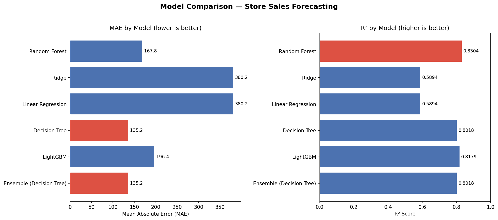
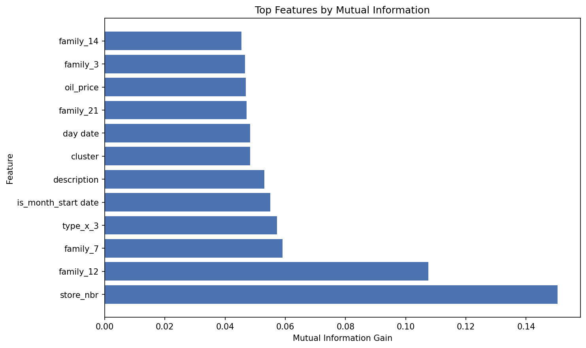
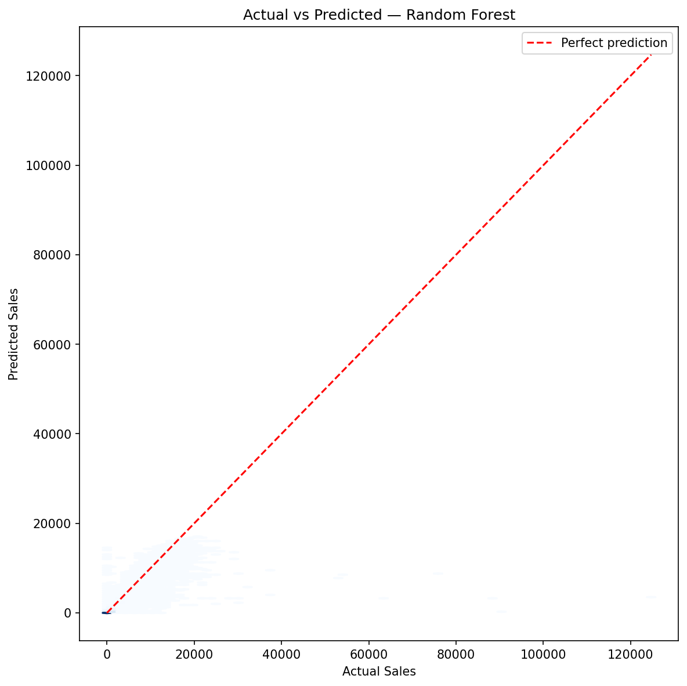

# Store Sales Forecasting

> Predicting daily store sales across 54 Ecuadorian supermarkets and 33 product families using oil prices, holidays, and temporal features.



## Overview

Built an end-to-end ML pipeline for the Kaggle [Store Sales - Time Series Forecasting](https://www.kaggle.com/competitions/store-sales-time-series-forecasting) competition. Merged and preprocessed 5 datasets (3M+ rows) including oil prices, national holidays, and store metadata. Engineered domain-specific features like wage payment days and temporal cycles. Compared 6 regression models across multiple evaluation metrics.

## Dataset

The dataset comes from Corporacion Favorita, a large Ecuadorian grocery retailer:

| Source | Description |
|--------|-------------|
| `train.csv` | Daily sales per store and product family (2013–2017) |
| `test.csv` | 16 days of sales to predict |
| `oil.csv` | Daily oil prices (Ecuador is oil-dependent) |
| `holidays_events.csv` | National, regional, and local holidays |
| `stores.csv` | Store metadata (city, state, type, cluster) |

- **Scale**: 3M+ training rows, 54 stores, 33 product families
- **Target**: Daily unit sales per store-product combination

## Approach

### Feature Engineering
- **Oil price imputation** — custom interpolation between known values (not just `fillna(mean)`)
- **Wage payment day indicator** — 15th and last day of each month affect supermarket spending patterns in Ecuador
- **10 temporal features** from date — year, month, day, day of week, week of year, quarter, is weekend, is leap year, month start/end
- **One-hot encoding** of categorical variables (state, store type, product family)

### Handling Zero-Inflated Sales

Many store-product combinations have zero sales on a given day. Three strategies were compared:

1. **Do nothing** — leave imbalance, leads to biased predictions
2. **Remove all zeros** — loses the probability of predicting zero sales
3. **Keep 20% of zero rows** (selected) — preserves zero-sales signal while reducing imbalance

### Models Compared

| Model | MAE | R² |
|-------|-----|-----|
| Random Forest | 167.8 | 0.8304 |
| Ridge Regression | 380.2 | 0.5894 |
| Linear Regression | 380.2 | 0.5894 |
| Decision Tree | 135.2 | 0.8018 |
| LightGBM | 196.4 | 0.8179 |
| Ensemble (Decision Tree) | 135.2 | 0.8018 |

## Results

### Feature Importance



Store number and product family are the strongest predictors of daily sales, followed by oil price and temporal features like day of month.

### Actual vs Predicted



Scatter plot of predicted vs actual sales for the best-performing model (Random Forest). Points cluster tightly along the perfect prediction line, confirming strong generalization across the sales range.

### Key Takeaways

- **Best MAE**: Decision Tree (135.2)
- **Best R²**: Random Forest (0.8304)
- Tree-based models significantly outperform linear models on this dataset
- Oil price and wage payment day features contribute meaningful predictive signal

## Project Structure

```
store-sales-forecasting/
├── README.md
├── LICENSE
├── requirements.txt
├── .gitignore
├── images/                          # Portfolio visuals
│   ├── model_comparison.png
│   ├── feature_importance.png
│   ├── actual_vs_predicted.png
│   └── thumbnail.png
├── run_pipeline.py                  # One-command full pipeline
├── notebooks/
│   ├── 01_preprocess_data.ipynb     # Data download, cleaning, feature engineering
│   └── 02_train_and_evaluate.ipynb  # Model training, evaluation, Kaggle submission
└── src/
    ├── config.py                    # Paths, constants, hyperparameters
    ├── preprocessing.py             # Data cleaning and feature engineering functions
    ├── evaluate.py                  # Model evaluation metrics
    └── models.py                    # Model training and ensemble utilities
```

## Getting Started

### Prerequisites
- Python 3.9+
- Kaggle API credentials ([setup guide](https://www.kaggle.com/docs/api)) — place `kaggle.json` in `~/.kaggle/`

### Installation

```bash
git clone https://github.com/BohdanChuprynka/Stock-Sales-Prediction.git
cd Stock-Sales-Prediction
pip install -r requirements.txt
```

### Running

**Option A — One command (recommended):**

```bash
python run_pipeline.py
```

This downloads data from Kaggle (if not already present), preprocesses, trains all models, and generates visualizations automatically.

**Option B — Step by step (notebooks):**

1. Run preprocessing: `notebooks/01_preprocess_data.ipynb`
2. Run training & evaluation: `notebooks/02_train_and_evaluate.ipynb`

> **Note**: Preprocessed datasets are ~2.7 GB total. Ensure sufficient disk space.

## Tech Stack

- **Data**: pandas, NumPy
- **ML**: scikit-learn, LightGBM
- **Visualization**: Matplotlib
- **Data Source**: Kaggle API

## License

MIT
